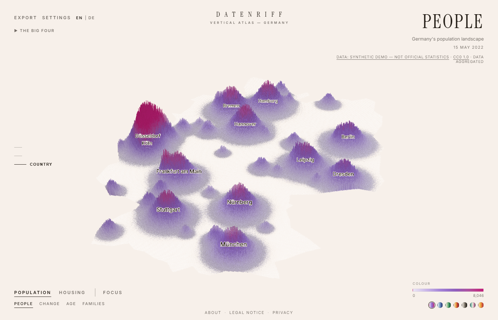

<p align="center">
  
</p>

# Datenriff — Vertical Atlas Germany

Germany, rebuilt out of data. Every spatial cell becomes a vertical column:
height carries a quantity, colour carries a property, time lets the landscape
grow and shrink. Not a dashboard and not a GIS — an interactive data atlas
with the feel of a printed poster.

Thirteen modes over six sources — census, night lights, wind power, rainfall,
land cover, forest loss — on one renderer, served as static files with no
backend at all.

[](https://github.com/Naxter/datenriff/actions/workflows/ci.yml)


*Above: the app's own poster export (`EXPORT`, 16:9) — Census 2022 population,
272,503 H3 cells of 460 m.*

## Features

- **Height means one thing everywhere.** A column is a density per unit area,
  so a cell says the same at country zoom and at street zoom. Counts are drawn
  per area and the fine levels derive their scale from the country level
  instead of being re-fitted to their own quantiles — without that, zooming in
  silently rewrites what tall means.
- **Thirteen modes, defined as data.** A mode is a height metric, a colour
  metric and a scale — not code. Switching blends both on the GPU; adding one
  is a definition, not a component.
- **Time as a landscape.** Night lights 2012–2025, wind power from 1990,
  rainfall year by year: the timeline scrubs between steps on the GPU, one
  uniform per frame, and the legend and tooltip follow the year on screen.
- **Detail that grows instead of swapping.** Fine tiles stream into the near
  field only, and the handover waits for coverage rather than a zoom
  threshold — so the same place is never a coarse cone and a fine needle in
  one frame.
- **Aggregation that respects the metric.** Counts sum, averages weight,
  shares divide numerator by denominator, categories take an argmax and
  desaturate mixed cells. Official suppression markers stay missing and never
  become zero.
- **Poster export.** Any view to PNG in 16:9, 4:5, 1:1 or 9:16 at up to 3×,
  or a GIF of a timeline sweep — composed in its own frame, with the full
  source credit on it.
- **Static all the way down.** Binary typed-array buffers plus one manifest.
  No server, no database, no API: a folder of files on a CDN.

## Quickstart (with demo data)

```bash
npm install
npm run demo             # a synthetic dataset, ~5 MB, one second
npm run build:manifest
npm run dev
```

The atlas comes up on <http://localhost:5173> with eight census modes.



The demo's numbers are **invented** — shaped to look like Germany, scaled so
the national total is right, but from nobody's statistics, and the credit
under the mode title says so. It exists so the renderer, the modes, the
timeline and the export can be tried before committing an afternoon to a
download.

## Real data

Each pipeline owns one source and writes the same binary format. The census is
the place to start ([pipelines/zensus](pipelines/zensus/README.md)) — a few
hundred MB of downloads, and the 2011 grid alone unpacks to 1.3 GB:

```bash
cd pipelines/zensus && .venv/Scripts/python run_all_metrics.py
cd ../.. && npm run build:manifest
```

`npm run demo` refuses to overwrite a real run; pass `--force` if replacing it
is what you want. Without the Node toolchain, the dependency-free prototype
renders the same binaries — `npx http-server .`, then
<http://localhost:8080/prototype/>.

## Modes

| Mode | Height | Colour |
| --- | --- | --- |
| PEOPLE | inhabitants | inhabitants (sqrt) |
| CHANGE | inhabitants 2022 | Δ 2011→2022, with a timeline morph |
| AGE | inhabitants | mean age |
| RENT | dwellings | net cold rent €/m² |
| HEATING | dwellings | dominant energy carrier |
| HOMES | dwellings | share built 2014 or later |
| VACANCY | dwellings | vacancy rate |
| FAMILIES | inhabitants | average household size |
| AFTER DARK | night-light radiance | radiance, played 2012–2025 — a NASA satellite product on the same renderer |
| WIND | installed wind power | the same, played 1990 onwards |
| RAIN | annual precipitation | the same, played year by year |
| LAND | artificial share of the cell | dominant land cover |
| FOREST | forest cover of the cell | share come down since 1985 |

Each mode is a data definition, not code: a height metric, a colour metric and
a scale. Switching modes blends both on the GPU. Some modes carry curated
camera moves; `EXPORT` writes a poster PNG in 16:9, 4:5, 1:1 or 9:16.

Height means the same thing at every level of detail. Counts — people,
dwellings, megawatts — are drawn per unit area, so a 66 m cell has to hold
proportionally as many to stand as tall as the 460 m cell above it; averages,
shares and rates are per-area figures already and carry over unchanged. Only
the country level is calibrated against its own statistics, and the finer
levels are derived from it.

The camera rests on composed stops — country, region, city — and flies
between them; the wheel, a double click and `+`/`−` step, and a pinch is drawn
to the nearest stop when it ends. Every stop belongs to exactly one level of
detail, so a reader never comes to rest mid-handover. The ladder on the left
says which stop is current and whether finer detail is still arriving.

Colour ramps are an option, not a constant: switch them via the dots below the
legend or by URL (`?palette=glacier|ember|noir|…`). The prototype takes the
same parameter.

## How it works

One renderer, many data sculptures. Every source is translated offline into
the same spatial model — H3 cells at several resolutions, binary metric
buffers, one manifest:

```
Sculpture = SpatialIndex × HeightMetric × ColorMetric × Time × Style
```

```
CSV / raster                 browser
    │                            │
 clean special values      manifest.json
    │                            │
 centroid → EPSG:3035       positions.bin + <metric>.f32/.u8
    │                            │
 WGS84 → H3 r10             TargetBuilder (elevations + RGBA)
    │                            │
 aggregate r9 / r8          MorphEngine (mode + timeline morphs)
    │                            │
 stats + binary writer      deck.gl ColumnLayer (binary attributes)
```

Aggregation follows metric semantics, never a blanket average: counts sum,
averages use `SUM(value·weight) / SUM(weight)`, shares use
`SUM(numerator) / SUM(denominator)`, categories take the argmax plus a
dominance value that desaturates mixed cells. Official suppression markers are
missing values, never zero.

More detail: [architecture](docs/architecture.md) ·
[data format](docs/data-format.md).

## Repository

```
apps/web/               React + Vite + deck.gl front end (ColumnLayer, binary attributes)
packages/
  data-contracts/       dataset, LOD manifest, metric and mode contracts
  color-scales/         palettes and typed-array colour mapping
  sculpture-core/       morph engine, elevation calibration, derived metrics
pipelines/
  zensus/               Python ETL: Destatis 100 m grid → H3 → binary
  black-marble/         NASA night lights raster → H3 → binary
prototype/              dependency-free WebGL2 viewer over the same binaries
scripts/                manifest builder, demo seeder, screenshot, picking and interface checks
docs/                   architecture, data format, testing, deploy
```

## Development

```bash
npm run build:manifest   # assemble the manifest from pipeline outputs
npm run lint             # eslint over app, packages and scripts
npm run typecheck        # package builds + app tsc
npm run test             # node:test (packages) + unittest (pipeline)
npm run build            # production build of apps/web
```

Three more checks drive a real browser and therefore need pipeline data on
the machine: hover picking, the interface suite (`npm run ui`) and the visual
regression (`npm run visual`). See [docs/testing.md](docs/testing.md).

The pipeline tests run against the interpreter found first: the
`pipelines/zensus/.venv` if present, otherwise `python3`/`python`/`py -3`. For
a real pipeline run install its dependencies:

```bash
python -m venv pipelines/zensus/.venv
pipelines/zensus/.venv/Scripts/pip install -e pipelines/zensus   # POSIX: .venv/bin/pip
```

The prototype in `prototype/` is the test bed for visual decisions — camera,
height calibration, lighting and shadows are tuned there by screenshot
comparison and mirrored into `apps/web`.

## Deploy

Cloudflare Pages, by **direct upload only** — the full walkthrough, including
the domains, compression and what to do after a pipeline re-run, is in
[docs/deploy.md](docs/deploy.md).

```bash
npm run deploy        # build → prune → wrangler pages deploy
```

The reason it cannot be a Git integration: `apps/web/public/data/` is
git-ignored, so a build on Cloudflare's runners would check out a repository
with no data and publish a site that loads its manifest, gets a 404 and shows
an error. The data has to come from a machine that has run the pipelines.

`npm run deploy` runs `scripts/prune-dist.mjs` in between, and that step is
load-bearing rather than an optimisation: unpruned, `zensus/r10/cells.txt` is
41 MiB and Cloudflare rejects any file over 25 MiB. Pruned, a deployment is
about 10,700 files and 292 MiB — inside the free plan's 20,000-file limit,
with the largest file at 2.1 MiB.

Two things that are easy to get wrong:

- **The hostname is a commit, not a flag.** `scripts/build-pages.mjs` reads
  `SITE_URL` and bakes it into the canonical links, `hreflang`,
  `sitemap.xml`, `robots.txt` and the atlas page's Open Graph tags. Changing
  it is `SITE_URL=https://… npm run build:pages` **and a commit** — otherwise
  CI's `git diff --exit-code apps/web/public` fails and the published
  canonicals point at the wrong place.
- **Pages does not purge on deploy.** After re-running a pipeline, purge the
  cache (Caching → Configuration → Purge Everything). Data files are cached
  for a day with a week of `stale-while-revalidate`, and buffers within one
  LOD are index-aligned — a visitor holding an old metric buffer beside a new
  positions buffer would see values on the wrong cells.

Worth checking once, on the first deploy, because it decides whether the data
is served at roughly half its size:

```bash
curl -sI -H 'Accept-Encoding: br, gzip' https://datenriff.pages.dev/data/zensus/r8/rent.f32
```

If there is no `content-encoding` in the response, Cloudflare is not
compressing `application/octet-stream`. Fixing that needs a Compression Rule,
which requires a domain proxied through Cloudflare — a custom domain, not
`*.pages.dev`.

## Scope and honesty

What this is not, stated plainly, because a picture this confident invites
more trust than it has earned:

- **The colours clip.** Sequential scales cut at a percentile so a handful of
  extreme cells do not flatten the rest, which means the top of a ramp is "at
  least this much", not "exactly this". Where a domain clips hard the About
  page names the share — AGE, for instance, clips 19.0 % at the bottom and
  16.8 % at the top.
- **Height is calibrated, not absolute.** Columns are scaled to read as a
  landscape and fall off with zoom. Read quantities from the tooltip, which
  carries the real value; do not measure them off the screen.
- **Cells are hexagons, sources are not.** Every pipeline re-grids something
  else — a 100 m square grid, a satellite raster, point coordinates — onto
  H3. That re-gridding is lossy at the edges by construction.
- **Census figures are already protected.** Destatis applies a cell-key
  method, so some values carry a fixed overlay. The atlas shows aggregated
  cells and makes no attempt to reconstruct households or buildings.
- **No accounts, no tracking, no cookies.** The site is static files. There is
  no analytics, no third-party embed and no consent banner, because there is
  nothing to consent to. The host sees ordinary request logs.
- **Only Germany**, and only what a pipeline has produced. There is no
  fallback dataset: an empty `public/data/` means an error page, deliberately,
  rather than an invented one.

## Data and licence

The repository ships code, not data: `apps/web/public/data/` is generated by
the pipelines and git-ignored. `npm run demo` writes a synthetic stand-in that
is nobody's statistics and says so in its own source credit.

### Licences

Three separate things, under three separate licences.

**Code** — Apache License 2.0, see [LICENSE](LICENSE) and [NOTICE](NOTICE).
Libraries bundled into a built site are listed with their own notices in
[THIRD-PARTY-NOTICES.md](THIRD-PARTY-NOTICES.md).

**Fonts** — Inter and Instrument Serif, both SIL Open Font License 1.1, not
covered by the code licence. Their licence texts sit beside them in
`apps/web/public/fonts/` ([Inter](apps/web/public/fonts/OFL-Inter.txt),
[Instrument Serif](apps/web/public/fonts/OFL-InstrumentSerif.txt)) and are
served with them.

**Data** — not covered by the code licence, and it cannot be: the rights
belong to the publishers below, and the pipeline outputs are derived works
that carry the source's conditions forward. Aggregating a grid into hexagons
does not wash the attribution off. Anyone republishing what these pipelines
produce owes the source's credit, including the note that the data was
modified — every pipeline here re-grids and aggregates what it reads.

| Mode | Source | Licence |
| --- | --- | --- |
| PEOPLE · CHANGE · AGE · RENT · HEATING · HOMES · VACANCY · FAMILIES | Destatis, Zensus 2022 and 2011, 100 m grid | DL-DE-BY-2.0 |
| WIND | Marktstammdatenregister (Bundesnetzagentur) | DL-DE-BY-2.0 |
| RAIN | Deutscher Wetterdienst, gridded annual precipitation | CC BY 4.0 |
| LAND | BKG, CORINE Land Cover 5 ha | DL-DE-BY-2.0, © GeoBasis-DE / BKG |
| FOREST | European Forest Disturbance Atlas (Viana-Soto & Senf) | CC BY 4.0 |
| AFTER DARK | NASA Black Marble VNP46A4 | NASA open data (CC0 unless marked) |
| FOCUS outlines | BKG VG2500 (`node scripts/fetch-states.mjs`) | DL-DE-BY-2.0, © GeoBasis-DE / BKG |

Attribution and the reference date travel in the manifest and stay visible in
the app, on desktop and mobile alike — for these sources the credit is a
licence condition, not decoration.

Census results are already statistically protected; the atlas shows
aggregated grid cells and makes no attempt to reconstruct individual
buildings or households.
