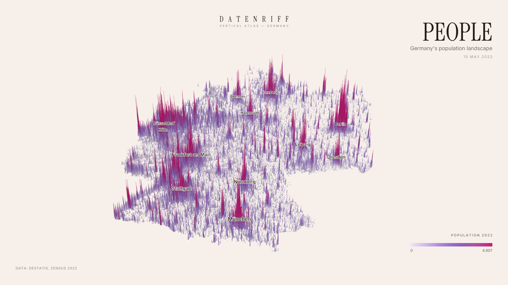

# Datenriff — Vertical Atlas Germany

Germany, rebuilt out of data. Every spatial cell becomes a vertical column:
height carries a quantity, colour carries a property, time lets the landscape
grow and shrink. Not a dashboard and not a GIS — an interactive data atlas
with the feel of a printed poster.



*The app's own poster export (`EXPORT`, 16:9): Census 2022 population,
272,503 H3 cells of 460 m.*

## Quickstart

```bash
npm install
npm run dev
```

The app comes up on <http://localhost:5173> — but it needs data first. The
atlas renders only what a pipeline produced; there is no bundled sample. Run
the [census pipeline](pipelines/zensus/README.md) (the downloads are a few
hundred MB, the 2011 grid alone unpacks to 1.3 GB), then:

```bash
npm run build:manifest
```

Without the Node toolchain, the dependency-free prototype renders the same
binaries:

```bash
npx http-server .
```

Then open <http://localhost:8080/prototype/>.

## Modes

| Mode | Height | Colour |
| --- | --- | --- |
| PEOPLE | inhabitants | inhabitants (sqrt) |
| CHANGE | inhabitants 2022 | Δ 2011→2022, with a timeline morph |
| AGE | inhabitants | mean age |
| RENT | dwellings | net cold rent €/m² |
| HEATING | dwellings | dominant energy carrier |
| HOMES | dwellings | share built 2014 or later |
| VACANCY | dwellings | vacancy rate |
| FAMILIES | inhabitants | average household size |
| AFTER DARK | night-light radiance | radiance, played 2012–2025 — a NASA satellite product on the same renderer |
| WIND | installed wind power | the same, played 1990 onwards |
| RAIN | annual precipitation | the same, played year by year |
| LAND | artificial share of the cell | dominant land cover |
| FOREST | forest cover of the cell | share come down since 1985 |

Each mode is a data definition, not code: a height metric, a colour metric and
a scale. Switching modes blends both on the GPU. Some modes carry curated
camera moves; `EXPORT` writes a poster PNG in 16:9, 4:5, 1:1 or 9:16.

Height means the same thing at every level of detail. Counts — people,
dwellings, megawatts — are drawn per unit area, so a 66 m cell has to hold
proportionally as many to stand as tall as the 460 m cell above it; averages,
shares and rates are per-area figures already and carry over unchanged. Only
the country level is calibrated against its own statistics, and the finer
levels are derived from it.

The camera rests on composed stops — country, region, city — and flies
between them; the wheel, a double click and `+`/`−` step, and a pinch is drawn
to the nearest stop when it ends. Every stop belongs to exactly one level of
detail, so a reader never comes to rest mid-handover. The ladder on the left
says which stop is current and whether finer detail is still arriving.

Colour ramps are an option, not a constant: switch them via the dots below the
legend or by URL (`?palette=glacier|ember|noir|…`). The prototype takes the
same parameter.

## How it works

One renderer, many data sculptures. Every source is translated offline into
the same spatial model — H3 cells at several resolutions, binary metric
buffers, one manifest:

```
Sculpture = SpatialIndex × HeightMetric × ColorMetric × Time × Style
```

```
CSV / raster                 browser
    │                            │
 clean special values      manifest.json
    │                            │
 centroid → EPSG:3035       positions.bin + <metric>.f32/.u8
    │                            │
 WGS84 → H3 r10             TargetBuilder (elevations + RGBA)
    │                            │
 aggregate r9 / r8          MorphEngine (mode + timeline morphs)
    │                            │
 stats + binary writer      deck.gl ColumnLayer (binary attributes)
```

Aggregation follows metric semantics, never a blanket average: counts sum,
averages use `SUM(value·weight) / SUM(weight)`, shares use
`SUM(numerator) / SUM(denominator)`, categories take the argmax plus a
dominance value that desaturates mixed cells. Official suppression markers are
missing values, never zero.

More detail: [architecture](docs/architecture.md) ·
[data format](docs/data-format.md).

## Repository

```
apps/web/               React + Vite + deck.gl front end (ColumnLayer, binary attributes)
packages/
  data-contracts/       dataset, LOD manifest, metric and mode contracts
  color-scales/         palettes and typed-array colour mapping
  sculpture-core/       morph engine, elevation calibration, derived metrics
pipelines/
  zensus/               Python ETL: Destatis 100 m grid → H3 → binary
  black-marble/         NASA night lights raster → H3 → binary
prototype/              dependency-free WebGL2 viewer over the same binaries
scripts/                manifest builder, screenshot and picking checks
docs/                   architecture, data format, roadmap
```

## Development

```bash
npm run build:manifest   # assemble the manifest from pipeline outputs
npm run typecheck        # package builds + app tsc
npm run test             # node:test (packages) + unittest (pipeline)
npm run build            # production build of apps/web
```

The pipeline tests run against the interpreter found first: the
`pipelines/zensus/.venv` if present, otherwise `python3`/`python`/`py -3`. For
a real pipeline run install its dependencies:

```bash
python -m venv pipelines/zensus/.venv
pipelines/zensus/.venv/Scripts/pip install -e pipelines/zensus   # POSIX: .venv/bin/pip
```

The prototype in `prototype/` is the test bed for visual decisions — camera,
height calibration, lighting and shadows are tuned there by screenshot
comparison and mirrored into `apps/web`.

## Data and licence

The repository ships code, not data: `apps/web/public/data/` is generated by
the pipelines and git-ignored.

### Licences

Three separate things, under three separate licences.

**Code** — Apache License 2.0, see [LICENSE](LICENSE) and [NOTICE](NOTICE).
Libraries bundled into a built site are listed with their own notices in
[THIRD-PARTY-NOTICES.md](THIRD-PARTY-NOTICES.md).

**Fonts** — Inter and Instrument Serif, both SIL Open Font License 1.1, not
covered by the code licence. Their licence texts sit beside them in
`apps/web/public/fonts/` ([Inter](apps/web/public/fonts/OFL-Inter.txt),
[Instrument Serif](apps/web/public/fonts/OFL-InstrumentSerif.txt)) and are
served with them.

**Data** — not covered by the code licence, and it cannot be: the rights
belong to the publishers below, and the pipeline outputs are derived works
that carry the source's conditions forward. Aggregating a grid into hexagons
does not wash the attribution off. Anyone republishing what these pipelines
produce owes the source's credit, including the note that the data was
modified — every pipeline here re-grids and aggregates what it reads.

| Mode | Source | Licence |
| --- | --- | --- |
| PEOPLE · CHANGE · AGE · RENT · HEATING · HOMES · VACANCY · FAMILIES | Destatis, Zensus 2022 and 2011, 100 m grid | DL-DE-BY-2.0 |
| WIND | Marktstammdatenregister (Bundesnetzagentur) | DL-DE-BY-2.0 |
| RAIN | Deutscher Wetterdienst, gridded annual precipitation | CC BY 4.0 |
| LAND | BKG, CORINE Land Cover 5 ha | DL-DE-BY-2.0, © GeoBasis-DE / BKG |
| FOREST | European Forest Disturbance Atlas (Viana-Soto & Senf) | CC BY 4.0 |
| AFTER DARK | NASA Black Marble VNP46A4 | NASA open data (CC0 unless marked) |
| FOCUS outlines | BKG VG2500 (`node scripts/fetch-states.mjs`) | DL-DE-BY-2.0, © GeoBasis-DE / BKG |

Attribution and the reference date travel in the manifest and stay visible in
the app, on desktop and mobile alike — for these sources the credit is a
licence condition, not decoration.

Census results are already statistically protected; the atlas shows
aggregated grid cells and makes no attempt to reconstruct individual
buildings or households.
