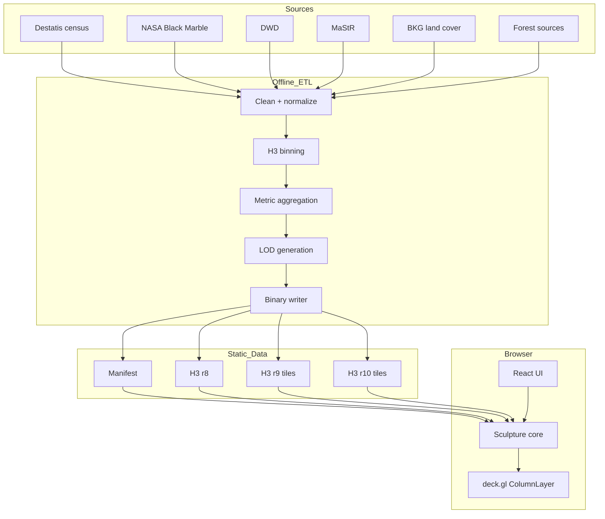

# Architecture

One renderer, many data sculptures. Every source (census, night lights,
precipitation, energy registry, land cover, forest) is translated offline into
the same spatial model: H3 cells at several resolutions, binary metric buffers
and one manifest. The renderer knows no data sources, only the contracts from
`@datenriff/data-contracts`:

```
Sculpture = SpatialIndex × HeightMetric × ColorMetric × Time × Style
```

## Overview



## Decisions

| Area | Decision |
| --- | --- |
| Front end | TypeScript, React, Vite, deck.gl ColumnLayer, Zustand |
| Data path | binary typed arrays; no GeoJSON, no object arrays |
| Spatial model | H3: r8 country · r9 regional (tiled) · r10 city (tiled) |
| Height | always linear; calibrated per sculpture as `targetMax / p99.5` |
| Colour | sqrt/log1p for quantities, diverging for change, categorical plus dominance; ramps switchable as an option |
| Basemap | none — off-white canvas with a subtle country outline |
| Lighting | ambient + warm key + cool fill; shadows only while the camera is idle |
| Camera | pitch ≈ 58, bearing ≈ −18, fovy ≈ 24 |
| Hosting | static-first: Vite build + binary assets + CDN; a backend only for live data |
| Preprocessing | Python; standard library core plus pyproj and h3 |

Deliberately no Cesium and no basemap: no globe, no terrain, no roads — the
aesthetic lives on empty paper.

## Front-end layers

```
React UI (Header, ModeNav, Timeline, Legend, Tooltip, Attribution)
   │  zustand store: modeId, timeT, palette, hover
   ▼
TargetBuilder (apps/web/src/sculpture/targets.ts)
   │  metric buffers → elevations (metres) + RGBA colours, cached per mode+palette
   ▼
MorphEngine (@datenriff/sculpture-core)
   │  mutates a pair of live buffers (mode morphs, timeline mix)
   ▼
deck.gl ColumnLayer (binary attributes; re-upload only for changed frames)
```

Elevations are precomputed per mode in metres, with the same calibration
across all time steps, so the engine can interpolate the buffers of two modes
directly. The CPU interpolates today — negligible at country LOD sizes — and a
shader mix (`height_from`/`height_to` + `u_mix`) can replace the internals
later without changing the API.

## Prototype

`prototype/` is a dependency-free WebGL2 viewer over the same binary data
(instanced hex prisms, flat shading, identical camera and light values). It
serves as the renderer test bed and as the calibration tool for composition
and height scale; its values are mirrored into `apps/web`
(`TARGET_MAX_HEIGHT_METERS`, `camera.ts`).
