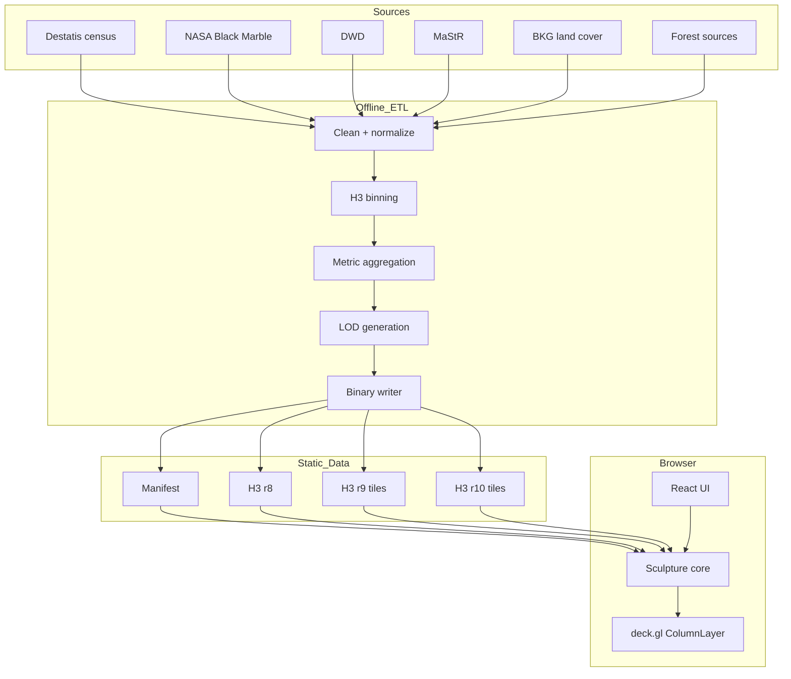

# Architecture

One renderer, many data sculptures. Every source (census, night lights,
precipitation, energy registry, land cover, forest) is translated offline into
the same spatial model: H3 cells at several resolutions, binary metric buffers
and one manifest. The renderer knows no data sources, only the contracts from
`@datenriff/data-contracts`:

```
Sculpture = SpatialIndex × HeightMetric × ColorMetric × Time × Style
```

## Overview



## Decisions

| Area | Decision |
| --- | --- |
| Front end | TypeScript, React, Vite, deck.gl ColumnLayer, Zustand |
| Data path | binary typed arrays; no GeoJSON, no object arrays |
| Spatial model | H3: r8 country · r9 regional (tiled) · r10 city (tiled) |
| Height | always linear; the country level is calibrated as `targetMax / p99.5`, the fine levels are derived from it per unit area |
| Colour | sqrt/log1p for quantities, diverging for change, categorical plus dominance; ramps switchable as an option |
| Basemap | none — off-white canvas with a subtle country outline |
| Lighting | ambient + warm key + cool fill; one stable effect, shadows cast onto a paper-coloured ground plane |
| Camera | pitch ≈ 58, bearing ≈ −18, fovy ≈ 24 |
| Hosting | static-first: Vite build + binary assets + CDN; a backend only for live data |
| Preprocessing | Python; standard library core plus pyproj and h3 |

Deliberately no Cesium and no basemap: no globe, no terrain, no roads — the
aesthetic lives on empty paper.

## Front-end layers

```
React UI (Header, ModeNav, Timeline, Legend, Tooltip, Stories, Export)
   │  zustand store: manifest, scene, modeId, timeT, palette, hover, story
   ▼
QualityProfile (sculpture/quality.ts)
   │  picks country LOD (r8 desktop / r7 mobile), DPR, shadows, labels, tiles
   ▼
TargetBuilder (sculpture/targets.ts)
   │  metric buffers → elevations (metres) + RGBA colours, per mode+palette
   ▼
MorphEngine (@datenriff/sculpture-core)
   │  holds both endpoints and an eased mixAmount
   ▼
MorphColumnLayer (patched deck.gl ColumnLayer)
   │  elevation = mix(from, to, mixAmount) on the GPU
   ▼
TileManager + worker  →  fine r9 tiles, decoded and coloured off-thread
```

Elevations are precomputed per mode in metres, with the same calibration
across all time steps, so two modes can be blended directly. The blend itself
runs on the GPU: both endpoints are uploaded as attributes and a single
uniform moves per frame, instead of rewriting every buffer.

Colour is calibrated per LOD, not per dataset. Coarser cells pool more
people, so p99.5 at r7 is ~21,000 inhabitants where r8 sees ~4,800 and r9
~1,200 — using one shared stat block flattens whichever resolution it does
not belong to. `SculptureLOD.metricStats` carries the numbers for each
resolution, and the tiled LODs carry theirs in the tile index.

Height is not. Only the country level is calibrated against its own
quantiles; the fine levels are derived from that one scale
(`fineElevationScale`), so height means the same thing at every zoom. A
count belongs to the area it was counted in and is redrawn per unit area —
an r10 cell covers a forty-ninth of an r8 cell and therefore stands at
forty-nine times the metres per person. A mean, a share or a rate is a
per-area figure already and carries the country scale unchanged. Calibrating
each level against itself made the same place change height as the level
changed under it, and put two differently scaled sculptures on screen at once
during the crossfade. The cost is paid at the camera: modes whose height is a
count ease down faster with zoom (`DENSITY_HEIGHT_FALLOFF`), which scales
every column in the frame alike and so leaves the relations inside a picture
intact.

## Prototype

`prototype/` is a dependency-free WebGL2 viewer over the same binary data
(instanced hex prisms, flat shading, identical camera and light values). It
serves as the renderer test bed and as the calibration tool for composition
and height scale; its values are mirrored into `apps/web`
(`TARGET_MAX_HEIGHT_METERS`, `camera.ts`).
